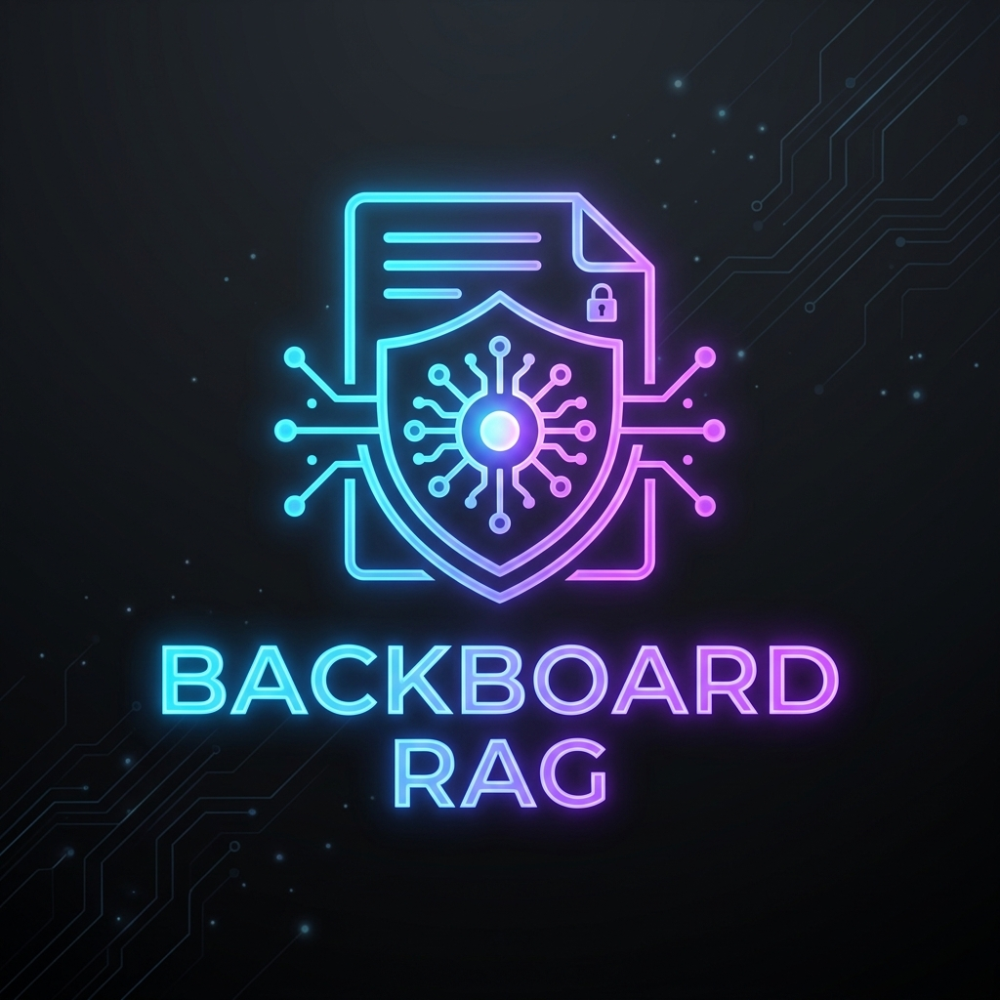
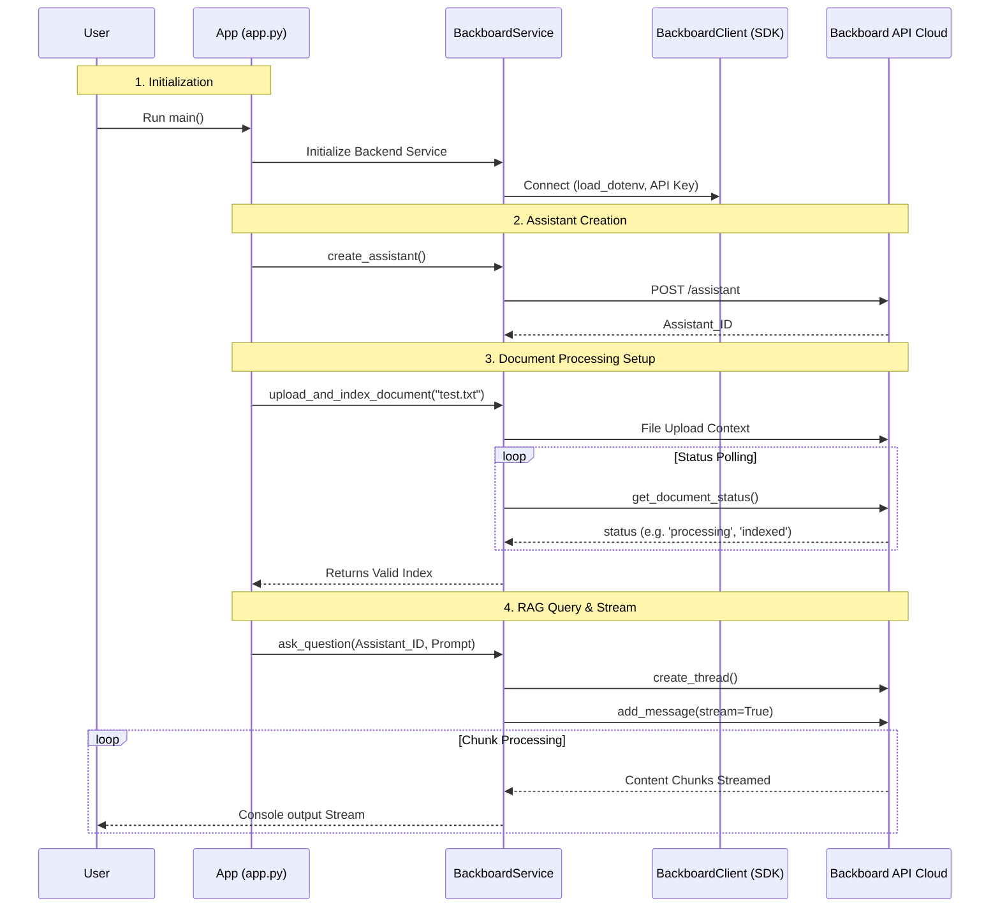

<div align="center">
  
     
  # Privacy-Aware RAG Bot
  
  **A seamless integration of AI document analysis and retrieval-augmented generation using the Backboard API.**
</div>

---

## 📖 Overview

The **Privacy-Aware RAG Bot** (Backboard RAG Application) is a modern, async-powered backend demo that securely processes documents, indexes them, and allows interactive querying natively. Leveraging the advanced orchestration provided by the `backboard-sdk`, this project aims to create a streamlined pipeline for parsing, loading, and obtaining intelligent AI responses to document-based data without compromising flexibility or privacy.

### Key Features
- **Async Execution:** Fully non-blocking architecture ensuring scalability.
- **Custom AI Assistants:** Provision dynamic document assistants initialized with personalized system prompts.
- **Document Indexing Pipeline:** Automated and smart polling to track the indexing status of your uploaded data in real time.
- **Streamed Question-Answering:** Employs real-time streaming capability to yield human-like instantaneous response chunks.
- **Secure Handling:** Leverages environment variables and token-based authentication mechanism.

---

## 🏗️ System Architecture

The following diagram highlights the interaction between your local application and the Backboard Ecosystem.



---

## 📁 Repository Structure

```text
├── assets/                     # Project logo and static assets
│   └── logo.png
├── backboard.io_RAG/
│   ├── app.py                  # Entry point to execute the backend demo
│   ├── requirements.txt        # Key python dependencies
│   ├── documents/              # Stores local documents to be indexed (e.g., test.txt)
│   ├── services/
│   │   └── backboard_service.py # Contains logic connecting user queries to Backboard
│   └── utils/
│       ├── config.py           # Loads environment variables
│       └── helpers.py          # UI helpers for the console script
└── README.md                   # This documentation snippet
```

---

## 🚀 Getting Started

Follow the steps below to setup and develop on this project structure.

### 1. Prerequisites
Ensure you have Python 3.9+ installed natively.
Also, acquire your `BACKBOARD_API_KEY` from your Backboard platform dashboard.

### 2. Environment Setup

Clone this repository and navigate to the source directory:
```bash
git clone https://github.com/pratyush06-aec/backboard_RAG.git
cd backboard_RAG
cd backboard.io_RAG
```

Create a virtual environment and install the required dependencies:
```bash
python -m venv venv

# Windows
venv\Scripts\activate
# macOS/Linux
source venv/bin/activate

pip install -r requirements.txt
```

### 3. Configuration

In the `backboard.io_RAG` directory, create a `.env` file in the root context of your execution folder containing:
```env
BACKBOARD_API_KEY=your_api_key_here
DEBUG=True
```

### 4. Run the Project

Create a sample text file in `documents/test.txt` consisting of multiple paragraphs of text. Then, execute the application to see the entire extraction and RAG pipeline running!

```bash
python app.py
```

---

## 💡 Developer Perspective & Next Steps
As you explore the codebase, focus primarily on the `services/backboard_service.py` to add new pipeline functionalities such as function calling, dynamic tool executions, and retrieving complex metadata payloads natively from the Backboard Client module.

---
*Built to empower data privacy through secure RAG extraction models.*
